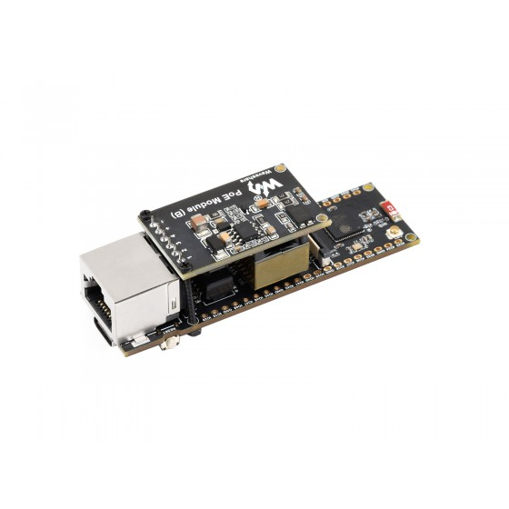

.. zephyr:board:: waveshare_esp32_s3_eth

Overview
********

The Waveshare ESP32-S3-ETH is a compact development board built around the
ESP32-S3-WROOM-1U-N16R8 module (dual-core Xtensa LX7, 16 MB flash, 8 MB octal
PSRAM) with an onboard WIZnet W5500 10/100 Ethernet controller wired to SPI2.
The USB-C connector is the ESP32-S3 native USB-Serial/JTAG peripheral, which
carries the console and is used for flashing and debugging.

   Waveshare ESP32-S3-ETH

For more information, see `ESP32-S3-ETH`_.

Hardware
********

- ESP32-S3-WROOM-1U-N16R8 module

  - Dual-core 32-bit Xtensa LX7, up to 240 MHz
  - 16 MB flash, 8 MB PSRAM
  - 2.4 GHz Wi-Fi and Bluetooth LE

- WIZnet W5500 10/100 Ethernet (RJ45) over SPI2
- USB Type-C (native USB-Serial/JTAG)

Ethernet wiring
===============

The W5500 is connected to SPI2 with the following pin assignment:

=========  =========
W5500      ESP32-S3
=========  =========
MOSI       GPIO11
MISO       GPIO12
SCLK       GPIO13
CS         GPIO14
RST        GPIO9
INT        GPIO10
=========  =========

The interrupt line (GPIO10) is wired in the board devicetree, so the W5500
driver runs IRQ-driven. Override ``int-gpios`` in an application overlay to
fall back to polling.

Supported Features
==================

.. zephyr:board-supported-hw::

Programming and Debugging
*************************

.. zephyr:board-supported-runners::

Build and flash applications as usual (see :ref:`build_an_application` and
:ref:`application_run`). Both the console and the flashing/debug interface are
exposed on the USB-C port.

.. code-block:: console

   west build -b waveshare_esp32_s3_eth/esp32s3/procpu <app>
   west flash

References
**********

.. target-notes::

.. _`ESP32-S3-ETH`: https://www.waveshare.com/wiki/ESP32-S3-ETH
