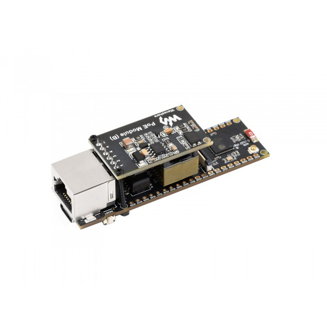

.. zephyr:board:: waveshare_esp32_s3_eth

Overview
********

The Waveshare ESP32-S3-ETH is a compact development board built around the
ESP32-S3-WROOM-1U-N16R8 module (dual-core Xtensa LX7, 16 MB flash, 8 MB octal
PSRAM) with an onboard WIZnet W5500 10/100 Ethernet controller wired to SPI2.
The USB-C connector is the ESP32-S3 native USB-Serial/JTAG peripheral, which
carries the console and is used for flashing and debugging.

   Waveshare ESP32-S3-ETH

For more information, see `ESP32-S3-ETH`_.

Hardware
********

- ESP32-S3-WROOM-1U-N16R8 module

  - Dual-core 32-bit Xtensa LX7, up to 240 MHz
  - 16 MB flash, 8 MB PSRAM
  - 2.4 GHz Wi-Fi and Bluetooth LE

- WIZnet W5500 10/100 Ethernet (RJ45) over SPI2
- microSD/TF card slot over SPI3
- WS2812B RGB status LED on GPIO21
- BOOT button on GPIO0
- USB Type-C (native USB-Serial/JTAG)

- Pico-compatible 2x20 expansion header (see `Expansion header`_)

The board also carries an OV5640-compatible DVP camera header, which is not
described in the board devicetree yet; its SCCB lines are the same GPIO47/48
pair exposed as ``i2c0``.

Ethernet wiring
===============

The W5500 is connected to SPI2 with the following pin assignment:

=========  =========
W5500      ESP32-S3
=========  =========
MOSI       GPIO11
MISO       GPIO12
SCLK       GPIO13
CS         GPIO14
RST        GPIO9
INT        GPIO10
=========  =========

The interrupt line (GPIO10) is wired in the board devicetree, so the W5500
driver runs IRQ-driven. Override ``int-gpios`` in an application overlay to
fall back to polling.

microSD wiring
==============

The TF slot is wired for SPI mode on SPI3, exposed as ``sdhc0``:

=========  =========
TF slot    ESP32-S3
=========  =========
MOSI       GPIO6
MISO       GPIO5
SCLK       GPIO7
CS         GPIO4
=========  =========

Expansion header
================

The 2x20 header uses the Raspberry Pi Pico footprint: the power and ground
positions match a Pico exactly, so many Pico HATs fit mechanically. The signal
positions carry ESP32-S3 GPIOs rather than RP2040 ones.

``pico_header`` is a GPIO nexus, so an overlay addresses a position by its
Pico ``GP`` number rather than by the ESP32-S3 GPIO behind it:

.. code-block:: devicetree

   my_device {
           /* GP6, header pin 9, which is GPIO42 on this board */
           int-gpios = <&pico_header 6 GPIO_ACTIVE_HIGH>;
   };

=====  ========  =========    =====  ========  =========
GP     Hdr pin   ESP32-S3     GP     Hdr pin   ESP32-S3
=====  ========  =========    =====  ========  =========
0      1         GPIO20       15     20        GPIO33
1      2         GPIO19       16     21        GPIO43
2      4         GPIO48       17     22        GPIO44
3      5         GPIO47       18     24        GPIO0
4      6         GPIO46       19     25        GPIO1
5      7         GPIO45       20     26        GPIO2
6      9         GPIO42       21     27        GPIO3
7      10        GPIO41       22     29        GPIO15
8      11        GPIO40       26     31        GPIO18
9      12        GPIO39       27     32        GPIO16
10     14        GPIO38       28     34        GPIO17
11     15        GPIO37
12     16        GPIO36
13     17        GPIO35
14     19        GPIO34
=====  ========  =========    =====  ========  =========

Two positions have no ``GP`` index and are not mapped: pin 30 (``CHIP_UP``,
where a Pico has ``RUN``) and pin 35 (GPIO21, where a Pico has ``ADC_VREF``).
GPIO21 also drives the onboard WS2812, so that position is not free anyway.

Before using a position, note:

- **GP0/GP1** are GPIO20/GPIO19, the native USB D+/D- lines. Driving them as
  GPIO conflicts with the USB console and the USB runner.
- **GP11-GP15** are GPIO37 down to GPIO33, the octal PSRAM interconnect on the
  ESP32-S3-WROOM-1U-N16R8. Waveshare document these as internally occupied:
  they are present on the header but cannot be driven on this module. They are
  mapped so the header description stays faithful to the hardware.
- **GP16/GP17** are GPIO43/GPIO44, which are UART0. Free unless ``uart0`` is
  enabled.
- **GP18** is GPIO0, which is also the BOOT button.

Emulation
=========

A ``/qemu`` board variant runs the board under Espressif's QEMU fork:

.. code-block:: console

   west build -b waveshare_esp32_s3_eth/esp32s3/procpu/qemu <app>
   west build -t run

The variant disables what QEMU does not model (Wi-Fi, Bluetooth, USB, SPI and
therefore both the W5500 and the TF slot, I2C and RMT) and moves the console to
UART0, since the USB-Serial/JTAG console is not emulated. See
:zephyr_file:`boards/espressif/common/qemu.rst` for prerequisites.

Supported Features
==================

.. zephyr:board-supported-hw::

Programming and Debugging
*************************

.. zephyr:board-supported-runners::

Build and flash applications as usual (see :ref:`build_an_application` and
:ref:`application_run`). Both the console and the flashing/debug interface are
exposed on the USB-C port.

.. code-block:: console

   west build -b waveshare_esp32_s3_eth/esp32s3/procpu <app>
   west flash

References
**********

.. target-notes::

.. _`ESP32-S3-ETH`: https://www.waveshare.com/wiki/ESP32-S3-ETH
