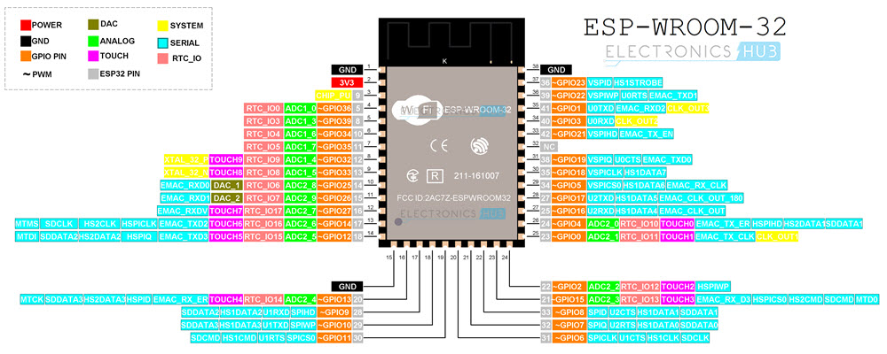

.. _ros_driver:

ROS-DRIVER
##############

Overview
********

ROS Driver for Robotics is an ESP32-based development board produced by `Waveshare <https://www.waveshare.com/>`_.

Functionality Overview
**********************

The block diagram below shows the main components of ROS-DRIVER and their interconnections.



System requirements
===================

Prerequisites
-------------

Espressif HAL requires WiFi and Bluetooth binary blobs in order work. Run the command
below to retrieve those files.

.. code-block:: console

   west blobs fetch hal_espressif

.. note::

   It is recommended running the command above after :file:`west update`.

Building & Flashing
*******************

Simple boot
===========

The board could be loaded using the single binary image, without 2nd stage bootloader.
It is the default option when building the application without additional configuration.

.. note::

   Simple boot does not provide any security features nor OTA updates.

MCUboot bootloader
==================

User may choose to use MCUboot bootloader instead. In that case the bootloader
must be build (and flash) at least once.

There are two options to be used when building an application:

1. Sysbuild
2. Manual build

.. note::

   User can select the MCUboot bootloader by adding the following line
   to the board default configuration file.
   ```
   CONFIG_BOOTLOADER_MCUBOOT=y
   ```

Sysbuild
========

The sysbuild makes possible to build and flash all necessary images needed to
bootstrap the board with the ESP32 SoC.

To build the sample application using sysbuild use the command:

.. zephyr-app-commands::
   :tool: west
   :app: samples/hello_world
   :board: ros_driver
   :goals: build
   :west-args: --sysbuild
   :compact:

By default, the ESP32 sysbuild creates bootloader (MCUboot) and application
images. But it can be configured to create other kind of images.

Build directory structure created by sysbuild is different from traditional
Zephyr build. Output is structured by the domain subdirectories:

.. code-block::

  build/
  ├── hello_world
  │   └── zephyr
  │       ├── zephyr.elf
  │       └── zephyr.bin
  ├── mcuboot
  │    └── zephyr
  │       ├── zephyr.elf
  │       └── zephyr.bin
  └── domains.yaml

.. note::

   With ``--sysbuild`` option the bootloader will be re-build and re-flash
   every time the pristine build is used.

For more information about the system build please read the :ref:`sysbuild` documentation.

Manual build
============

During the development cycle, it is intended to build & flash as quickly possible.
For that reason, images can be build one at a time using traditional build.

The instructions following are relevant for both manual build and sysbuild.
The only difference is the structure of the build directory.

.. note::

   Remember that bootloader (MCUboot) needs to be flash at least once.

Build and flash applications as usual (see :ref:`build_an_application` and
:ref:`application_run` for more details).

.. zephyr-app-commands::
   :zephyr-app: samples/hello_world
   :board: ros_driver/esp32/procpu
   :goals: build

The usual ``flash`` target will work with the ``ros_driver`` board
configuration. Here is an example for the :ref:`hello_world`
application.

.. zephyr-app-commands::
   :zephyr-app: samples/hello_world
   :board: ros_driver/esp32/procpu
   :goals: flash

Open the serial monitor using the following command:

.. code-block:: shell

   west espressif monitor

After the board has automatically reset and booted, you should see the following
message in the monitor:

.. code-block:: console

   ***** Booting Zephyr OS vx.x.x-xxx-gxxxxxxxxxxxx *****
   Hello World! ros_driver

Debugging
*********

ESP32 support on OpenOCD is available upstream as of version 0.12.0.
Download and install OpenOCD from `OpenOCD`_.

On the ROS Driver board, the JTAG pins are not run to a
standard connector (e.g. ARM 20-pin) and need to be manually connected
to the external programmer (e.g. a Flyswatter2):

+------------+-----------+
| ESP32 pin  | JTAG pin  |
+============+===========+
| 3V3        | VTRef     |
+------------+-----------+
| EN         | nTRST     |
+------------+-----------+
| IO14       | TMS       |
+------------+-----------+
| IO12       | TDI       |
+------------+-----------+
| GND        | GND       |
+------------+-----------+
| IO13       | TCK       |
+------------+-----------+
| IO15       | TDO       |
+------------+-----------+

Further documentation can be obtained from the SoC vendor in `JTAG debugging
for ESP32`_.

Here is an example for building the :ref:`hello_world` application.

.. zephyr-app-commands::
   :zephyr-app: samples/hello_world
   :board: ros_driver/esp32/procpu
   :goals: build flash
   :gen-args: -DOPENOCD=<path/to/bin/openocd> -DOPENOCD_DEFAULT_PATH=<path/to/openocd/share/openocd/scripts>

You can debug an application in the usual way. Here is an example for the :ref:`hello_world` application.

.. zephyr-app-commands::
   :zephyr-app: samples/hello_world
   :board: ros_driver/esp32/procpu
   :goals: debug

Note on Debugging with GDB Stub
===============================

GDB stub is enabled on ESP32.

* When adding breakpoints, please use hardware breakpoints with command
  ``hbreak``. Command ``break`` uses software breakpoints which requires
  modifying memory content to insert break/trap instructions.
  This does not work as the code is on flash which cannot be randomly
  accessed for modification.

.. _`OpenOCD`: https://github.com/openocd-org/openocd
.. _`JTAG debugging for ESP32`: https://docs.espressif.com/projects/esp-idf/en/latest/esp32/api-guides/jtag-debugging/index.html

Related Documents
*****************

.. _ROS_DRIVER schematics: https://files.waveshare.com/wiki/RaspRover/ROS_Driver_for_Robots.pdf (PDF)
.. _ESP32 Datasheet: https://www.espressif.com/sites/default/files/documentation/esp32_datasheet_en.pdf (PDF)
.. _ESP32-WROOM-32UE Datasheet: https://www.espressif.com/sites/default/files/documentation/esp32-wroom-32e_esp32-wroom-32ue_datasheet_en.pdf (PDF)
.. _ESP32 Hardware Reference: https://docs.espressif.com/projects/esp-idf/en/latest/esp32/hw-reference/index.html